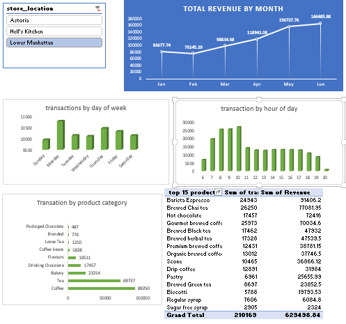
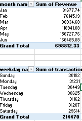

# coffee-sales-Analysis

## Introduction/Overview
Project Overview/Introduction
Introduction
In this project, we analyze a dataset containing transaction records from a coffee shop chain operating in more than two locations: Lower Manhattan, Hell's Kitchen and Astoria. The dataset provides detailed information about each transaction, including transaction ID, date, time, quantity purchased, store details, product information, unit price, and revenue generated. Our objective is to gain insights into customer behavior, popular products, and revenue trends across different locations and times.

The objective of analyzing this dataset is to derive actionable insights and strategic recommendations for the coffee shop chain based on transactional data. Specifically, the analysis aims to:
1.	Understand Customer Behavior: Investigate which products are most popular among customers, both in terms of quantity sold and revenue generated, to optimize inventory and marketing efforts.
2.	Identify Sales Trends: Determine peak sales hours, days, and months to improve staffing schedules and resource allocation across different store locations.
3.	Enhance Product Offering: Analyze the performance of different product categories (e.g., coffee, tea, bakery) and variants (e.g., sizes, flavors) to refine the product mix and introduce new offerings based on customer preferences.
4.	Optimize Revenue Generation: Calculate and compare revenue generated from various products and store locations to identify opportunities for maximizing profitability.
5.	Inform Business Strategy: Provide insights that support strategic decision-making, such as pricing adjustments, promotional activities, and expansion plans, tailored to each store location and product category.
   
## Data Fields
1.	Transaction_id: Unique identifier for each transaction.
2.	Transaction_date: Date of the transaction (format: MM/DD/YYYY).
3.	Transaction_time: Time of the transaction (format: HH:MM).
4.	Transaction_qty: Quantity of the product purchased in each transaction.
5.	Store_id: Identifier for the store location where the transaction occurred.
6.	Store_location: Location of the store (e.g., Lower Manhattan, Hell's Kitchen).
7.	Product_id: Identifier for the product purchased.
8.	Unit_price: Price per unit of the product.
9.	Product_category: Broad category of the product (e.g., Coffee, Tea, Drinking Chocolate, Bakery).
10.	Product_type: Type or variant of the product (e.g., Gourmet brewed coffee, Brewed Chai tea).
11.	Product_detail: Detailed description or size variant of the product (e.g., Ethiopia Rg, Spicy Eye Opener Chai Lg).
12.	Revenue: Total revenue generated from the transaction (calculated as transaction_qty * unit_price).
13.	Month: Name of the month when the transaction occurred (e.g., Jan for January).
14.	Name: Name of the month in full (e.g., January).
15.	Month: Numeric representation of the month (e.g., 1 for January).
16.	Weekday: Day of the week when the transaction occurred (e.g., Sunday).
17.	Weekday number: Numeric representation of the weekday (e.g., 7 for Sunday).
18.	Hour: Hour of the day when the transaction occurred (24-hour format).

## Skilled demonstrated

1. Data Analysis and Interpretation
• Analyze transaction data to derive insights into sales trends, product performance, and customer preferences.
• Handling and interpreting structured data such as transaction IDs, dates, times, quantities, prices, and categorical variables like product categories and types
2. Statistical Analysis and Metrics Calculation
• Calculating metrics such as total revenue, average transaction size, and sales distributions across different products, categories, stores, and time periods (months, weekdays, hours).
• Applying of statistical methods to identify patterns and trends in transaction data.
3.	Visualization and Reporting
•	Visualizations such as pivot table and pivot charts to present data insights effectively to stakeholders.

 
 
5.	Business Insights and Decision-Making
• Deriving actionable insights from data analysis through business decisions, such as product pricing strategies, inventory management, and store performance evaluation.
• Understanding of how data-driven insights can be used to optimize business operations and enhance profitability
6.	Time Management and Project Coordination
• Demonstrated ability to handle large datasets and perform analysis within a specified timeframe (e.g., analyzing data from January 1, 2023).
7.	• Organizational skills to manage and coordinate tasks related to data cleaning, analysis, and reporting.
8.	Technical Proficiency
•	Using tools and software for data analysis and visualization (e.g., Excel, Python, R, Tableau).
• Ability to manipulate and query datasets to extract relevant information for analysis purposes.

## Dataset Summary

The dataset comprises transactions recorded on January 1st to June 2023, spanning three locations:

•	Lower Manhattan: Transactions occurred throughout the day, starting from 7:06 AM to 7:59 AM, with a diverse range of products including coffee, tea, drinking chocolate, and bakery items.

•	Hell's Kitchen: Transactions began at 8:00 AM, featuring fewer entries compared to Lower Manhattan, with a focus on drinking chocolate, herbal tea, and other beverages.

## Key Points of Analysis

1.	Product Categories: The dataset includes products categorized into coffee, tea, drinking chocolate, and bakery items, each with specific types and sizes.
2.	Sales Distribution: Lower Manhattan exhibits a broader range of products and higher transaction volumes compared to Hell's Kitchen, indicating potentially higher customer traffic or a larger product selection.
3.	Time Analysis: Transactions are recorded hourly, allowing for analysis of peak sales hours and product popularity during specific times of the day.
4.	Revenue Insights: Calculating revenue from unit prices and quantities provides insights into the financial performance of different product categories and store locations.

## Findings
1. According to the data given, we have a total transaction of  about 149456 and all transations are from January to June 2023. there coffee shops are located in three rejions which are Lower manhattan, Heells Kitchen and Astoria.
2. total revenue generated from the Pivot chart table is about $6,234,384.84 from the six months. it was alos recored that there are some months that have higher sales and some months that have lower sales. eg the montg of may rrecoreded the highest sales in a month while the month of june was recorded a the lowest sales month. also transation are made by days of the week for example we have sunday and total transations made on sundaus from Ist January to 3oth June is over 33,494 transaction and so on.
3. transations by hour of day are also recorded. sales starts fro exactly six o'clock from Ist January till 30ths June and transactions have gone through all this hours. 

## Recommendations

• Stock Management: Ensure adequate stock of popular items like Gourmet brewed coffee, Brewed Chai tea, and Hot chocolate, especially during peak hours.
• Targeted Promotions: Consider promotions or discounts on less popular items or during off-peak hours to balance sales.
• Store Expansion: Evaluate the possibility of expanding product offerings in locations with fewer transactions (e.g., Hell's Kitchen) to increase revenue.
